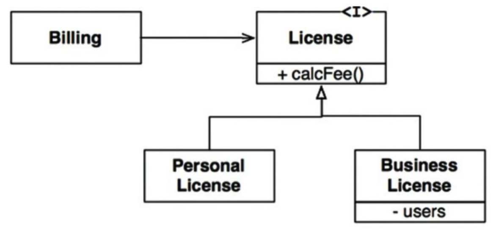
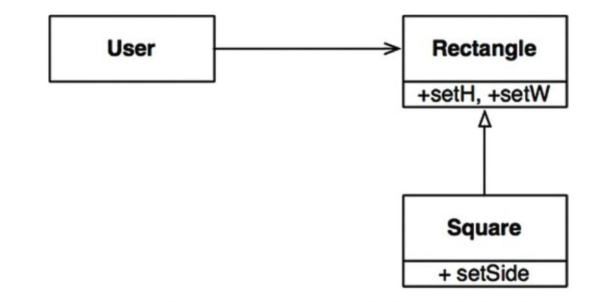
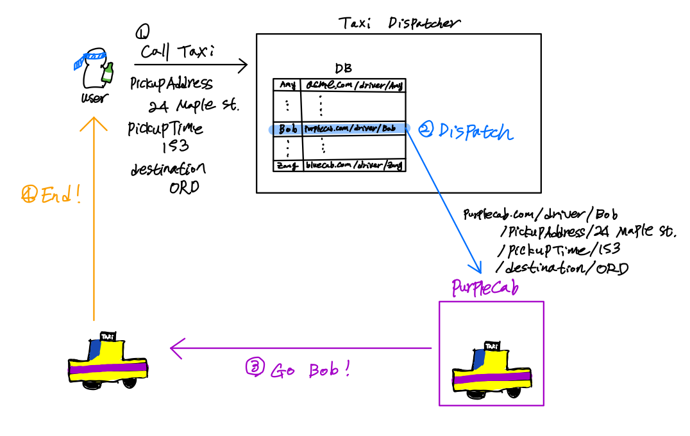
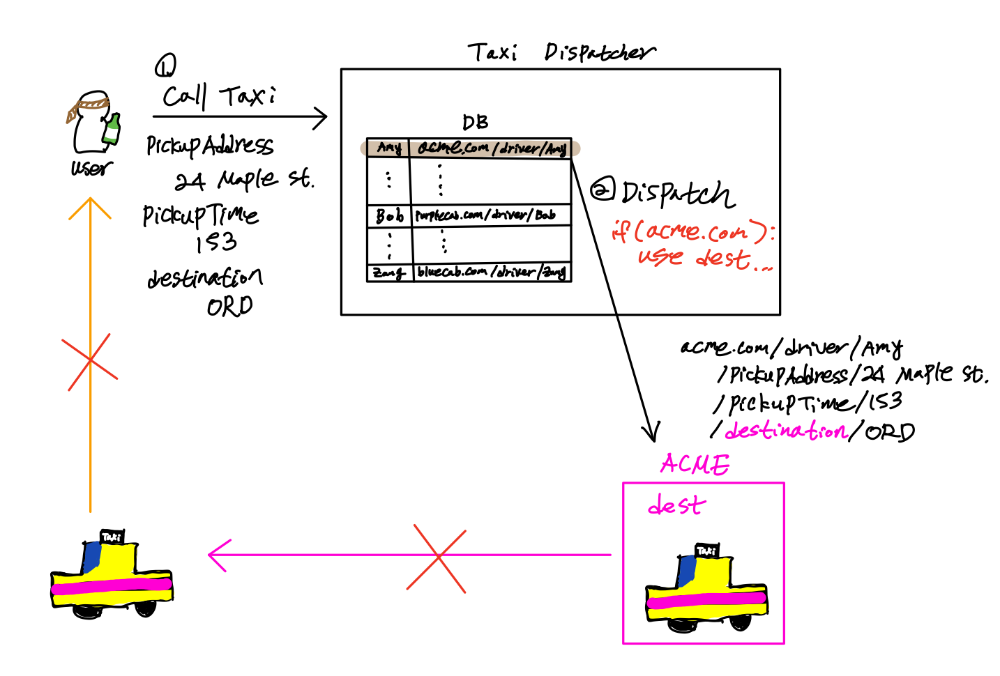
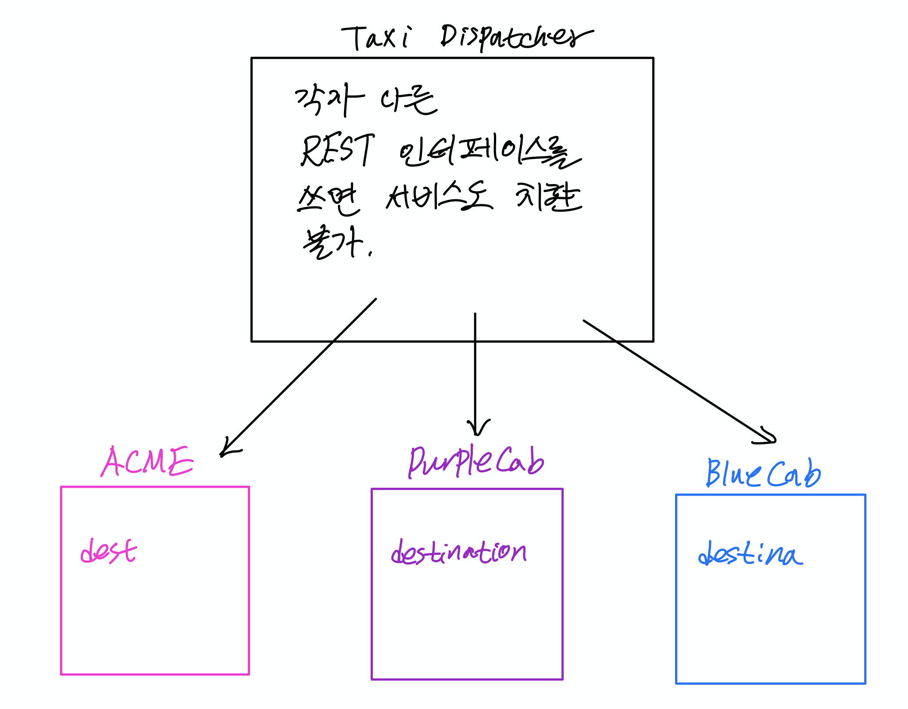
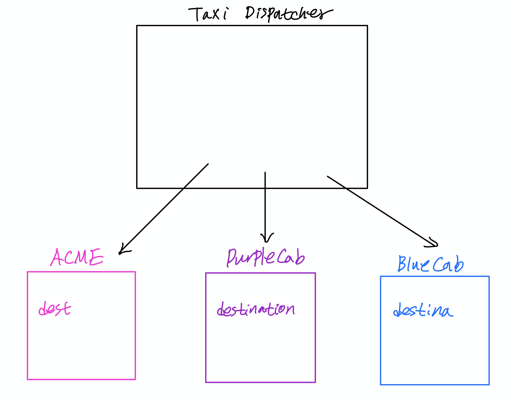
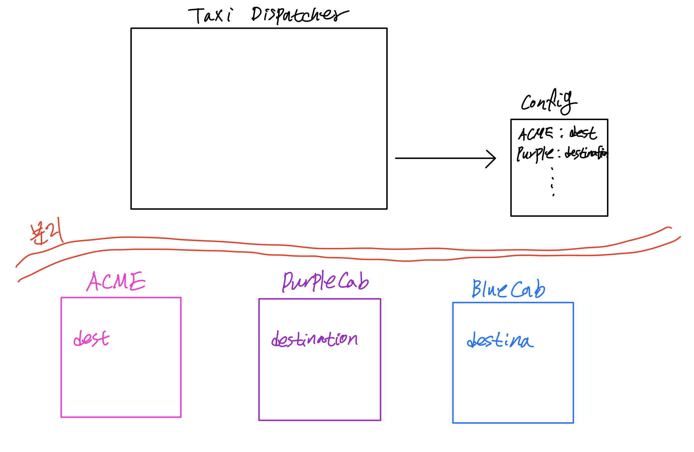

# 리스코프 치환 원칙 (LSP)

---

## LSP란 무엇인가: 하위 타입이란 무엇인가

```
여기에서 필요한 것은 다음과 같은 치환 원칙이다. 
S 타입의 객체 o1 각각에 대응하는 T 타입 객체 o2가 있고, 
T 타입을 이용해서 정의한 모든 프로그램 P에서 o2의 자리에 o1을 치환하더라도 
P의 행위가 변하지 않는다면, S는 T의 하위타입이다.
```

---

## LSP란 무엇인가: 하위 타입이란 무엇인가

```
S는 T의 하위 타입인가?
T 타입의 인스턴스들을 전부 S타입의 인스턴스들로 바꿔도 의도한 결과가 나오면 OK.
```

---

## 바른 예제 1
<style>
img[alt~="center"] {
  display: block;
  margin: 0 auto;
}
</style>


예상: license 사용 비용 계산


---

## LSP 위반 예제 1
<style>
img[alt~="center"] {
  display: block;
  margin: 0 auto;
}
</style>


---

## LSP 위반 예제 1
```java
Rectangle r = ...
r.setW(10)
r.setH(20)
assertEquals(r.area() == 200)
```

기대: 어떤 직사각형을 넣든, assert 성공

결과: Square의 instance를 넣으면, 기대한대로 동작하지 않음 
(LSP 위반, 어떤 프로그램 P는 동작이 변화)

---

## 왜 저런 문제가 생긴걸까?

LSP는 컴파일러가 해결해주는 문제가 아니라, 프로그래머가 해결해야 할 문제

즉, 컴파일은 정상적으로 되는데, 불안정한 프로그램을 만드는 방법 중 하나

---

## Programming Language 관점

현대 언어의 특징 중 하나: 돌려볼 가치가 없으면 컴파일 안해줌

돌려볼 가치를 판단하는 기준 중 하나: Type Checking

### 예제 1
`+` 연산: int + int, String + String에서 정의된다고 가정
```kotlin
1 + "hello" // Compile 안해줌, int + String 따위는 존재하지 X
```

### 예제 2
`+` 연산: int + int, String + String에서 정의된다고 가정
```kotlin
a = 1  // 3. a의 타입이 int구나! 그러면 b도 int고, 그러면 b + 5는 말이 되군. 컴파일 해드림
b = 2 + a  // 2. a의 타입이 int인가? 
b + 5  // 1. b의 타입이 int인가?
```

--- 

## Programming Language 관점

```java
Rectangle r = new Square(size=10); // Square는 Rectangle인가? Yes? No?
r.setW(10) // r.setW는 rectangle이 가진 함수, r은 rectangle인가?
r.setH(20) // r.setH는 rectangle이 가진 함수, r은 rectangle인가?
assertEquals(r.area() == 200) // r.area()는 rectangle이 가진 함수, r은 rectangle인가? 
```

Compiler 관점: Square는 Rectangle을 상속받으니까 OK.

사실 안전하지 않은데, 안전한 프로그램이라고 판단

즉, 프로그래머가 조심해야할 부분

---

## LSP를 어기지 않으려면?

1. 하위타입은 상위타입의 선행조건을 강화하면 안됨
    * 상위타입의 이용자들에게, 이용을 위해 추가적으로 무언가를 요구하면 안됨
    * 예를 들어, 생성할 때 가로와 세로를 항상 같게 해달라는 것은 선행조건 강화

2. 하위타입은 상위타입이 후행조건을 약화하면 안됨
    * 상위타입이 이용자들을 위해 하겠다고 보장한 것은 하나도 빠짐없이 다 해야함
    * ex) area()를 호출하면 (가로 x 세로)를 반환해주겠다

3. 하위타입은 상위타입의 불변식을 유지해야함
    * 상위타입 이용자가 당연히 유지될 것이라고 생각하는 것은 유지해줘야 함
    * ex) area()를 호출한 뒤에도 가로와 세로의 값은 변함이 없어야 한다.

---

## LSP는 더 높은 추상화 차원으로 확장할 수 있다
    
* ex) 동일한 REST 인터페이스에 응답하는 서비스 집단  

---

## LSP 위반 예제 2: Taxi Dispatcher

<style>
img[alt~="center"] {
  display: block;
  margin: 0 auto;
}
</style>


---

## LSP 위반 예제 2: Taxi Dispatcher

<style>
img[alt~="center"] {
  display: block;
  margin: 0 auto;
}
</style>


---

## LSP 위반 예제 2: Taxi Dispatcher

<style>
img[alt~="center"] {
  display: block;
  margin: 0 auto;
}
</style>


---

## LSP 위반 예제 2: Taxi Dispatcher

<style>
img[alt~="center"] {
  display: block;
  margin: 0 auto;
}
</style>


---

## LSP 위반 예제 2: Taxi Dispatcher

<style>
img[alt~="center"] {
  display: block;
  margin: 0 auto;
}
</style>


---

# End!


